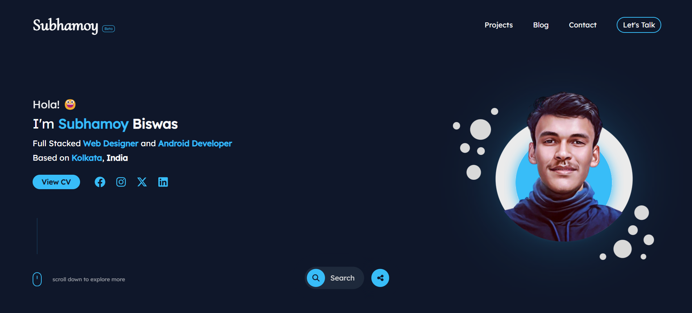

# Subhamoy Biswas - Portfolio Website

### Official Portfolio Website of Subhamoy Biswas (@neo_subhamoy)
[](https://github.com/neosubhamoy/neosubhamoy-portfolio/)
[](https://github.com/neosubhamoy/neosubhamoy-portfolio/)
[](https://github.com/neosubhamoy/neosubhamoy-portfolio/)
<br></br>

### 👀 Preview



### 📌 Tech Stack


### 🛠️ Contributing

Want to be the part of this project? Get started by following this simple steps . . .

1. Clone this repository in your dev server public folder (eg: 'htdocs' for XAMPP Server)
2. Install node dependencies

```code
npm install
```
3. Run development process
```code
npm run dev
```
4. Website will be running on this url
```code
http://localhost/neosubhamoy-portfolio/htdocs/
```
5. Using a Self Signed SSL in dev server is highly recommended as some of the site features only works with secure https protocol

⭕ Noticed any Bugs? or Want to give me some suggetions? always feel free to open an issue...!!

### 📝 License & Usage

Subhamoy Biswas - Portfolio Website is a Fully Open Sourced Project licensed under MIT License but still some parts of this website are not allowed to use or distribute without proper permission or attribution. All the contents (eg: informations, blog posts, articles) published in this website and the visual components (eg: layout, design, animations, images, videos, graphics) used in this website are not covered under the MIT License and requires special permission to be used. Using these without prior permission will cause legal actions.

**🌟 Liked this project? Please consider giving it a star to show me your appreciation.**
<br></br>
<br></br>

****

An Open Sourced Project - Developed with ❤️ by **Subhamoy**